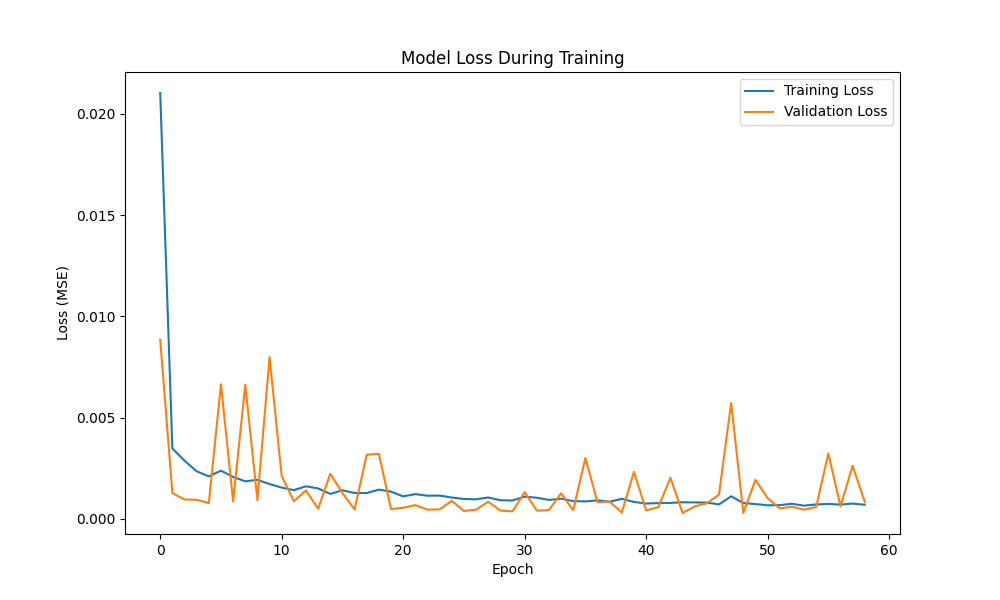

# Prediksi Harga Saham Microsoft Menggunakan LSTM


## Anggota

1. Azzrial Arfiansyah (Ketua) - 2310512084
2. Arya Davi Sulaiman - 2310511064
3. Muhammad Boby Pratama - 2310512056

## Overview Aplikasi

https://prediksisahammicrosoftlstm-3u2bctdjkfvjfvrfyelxs8.streamlit.app/

## Tujuan Proyek

Proyek ini bertujuan untuk memprediksi harga saham Microsoft (MSFT) menggunakan model deep learning LSTM (Long Short-Term Memory). Model ini memanfaatkan data historis harga saham selama beberapa tahun untuk mempelajari pola dan tren, kemudian melakukan prediksi harga di masa depan. Pendekatan ini menggabungkan analisis deret waktu dengan kemampuan LSTM untuk mengenali pola jangka panjang dalam data sekuensial.

## Tools yang Digunakan

- **Python 3.10+**: Bahasa pemrograman utama
- **TensorFlow/Keras**: Framework deep learning untuk membangun dan melatih model LSTM
- **Pandas & NumPy**: Untuk manipulasi dan analisis data
- **yfinance**: Untuk mengunduh data historis saham dari Yahoo Finance
- **Scikit-learn**: Untuk preprocessing data dan evaluasi model
- **Matplotlib & Plotly**: Untuk visualisasi data dan hasil
- **Streamlit**: Untuk membuat aplikasi web interaktif
- **Joblib**: Untuk menyimpan dan memuat model

## Instalasi dan Persiapan

### 1. Clone Repository

```bash
git clone https://github.com/piyuuu19/prediksi_saham_microsoft_lstm.git
```

```bash
cd prediksi_saham_microsoft_lstm
```

### 2. Buat dan Aktifkan Virtual Environment

```bash
# Windows
python -m venv venv
venv\Scripts\activate

# Linux/Mac
python3 -m venv venv
source venv/bin/activate
```

### 3. Install Dependensi

```bash
pip install -r requirements.txt
```

## Melatih Model

Untuk melatih model LSTM dengan data terbaru, jalankan:

```bash
python train_model.py
```

Proses ini akan:

1. Mengunduh data historis saham Microsoft dari Yahoo Finance
2. Memproses dan membagi data menjadi set training dan testing
3. Membangun dan melatih model LSTM
4. Mengevaluasi performa model
5. Menyimpan model, scaler, dan visualisasi di folder artifacts

File yang dihasilkan dalam folder artifacts:

- best_msft_lstm_model.keras: Model LSTM terlatih
- scaler.pkl: Objek MinMaxScaler untuk normalisasi data
- training_loss.png: Grafik loss training dan validasi
- test_predictions_vs_actual.png: Grafik perbandingan prediksi vs harga aktual

## Menjalankan Aplikasi Streamlit

Setelah model dilatih, kita menjalankan aplikasi web Streamlit untuk visualisasi interaktif:

```bash
streamlit run app.py
```

Aplikasi ini menyediakan:

- Visualisasi data historis harga saham Microsoft
- Informasi tentang model dan konfigurasinya
- Demo visualisasi (versi lengkap memerlukan model terlatih)

## Deployment ke Streamlit Community Cloud

Untuk men-deploy aplikasi ke Streamlit Community Cloud:

### 1. Persiapan Repository GitHub

- Push kode ke repository GitHub
- Pastikan requirements.txt telah diperbarui

### 2. Membuat file runtime.txt (untuk menentukan versi Python)

```bash
python-3.10
```

### 3. Login dan Deploy

1. Buka share.streamlit.io
2. Login dengan GitHub
3. Klik "New app"
4. Pilih repository, branch, dan file utama (app.py)
5. Klik "Deploy"

## Contoh Hasil

Setelah melatih model, kita akan mendapatkan visualisasi seperti ini di folder artifacts:

### Training loss



### Prediksi vs Harga Aktual


